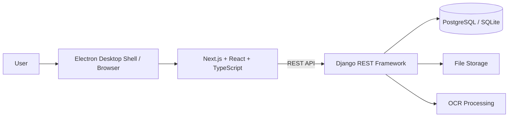

# Archive Management System

A full-stack archive management application for organizing, digitizing, storing, searching, and managing records and digital documents. The project combines a Next.js/TypeScript interface, a Django REST Framework API, PostgreSQL-oriented deployment, OCR-assisted document processing, and an Electron desktop shell for Windows.

[](https://github.com/Elys2105/QuanLyKhoLuuTru/actions/workflows/ci.yml)

## Overview

The system is designed to support archive workflows such as document and record management, storage organization, data entry, search, import/export, reporting, OCR processing, and system activity tracking.

The repository keeps application source code, migrations, scripts, configuration templates, and documentation in Git. Runtime data such as uploaded files, databases, secrets, generated reports, backups, and release binaries are intentionally kept outside version control.

## Key Features

- Archive and storage management
- Record and digital document management
- Document upload, preview, search, and retrieval workflows
- OCR-assisted document digitization
- Data import and export workflows
- Dashboard and reporting views
- Catalog and storage-tree management
- Authentication and protected application areas
- System logs and operational records
- Windows desktop packaging with Electron
- Backup and deployment support for local/client-server environments

## Tech Stack

### Frontend
- Next.js 16
- React 19
- TypeScript
- Tailwind CSS
- TanStack Query / TanStack Table
- React Hook Form + Zod
- Zustand
- Axios

### Backend
- Python
- Django
- Django REST Framework
- JWT-based authentication
- PostgreSQL for server/central environments
- SQLite supported for local/development/test environments
- OCR processing

### Desktop & Tooling
- Electron
- electron-builder
- Git / GitHub
- GitHub Actions
- PowerShell deployment and validation scripts

## Architecture



The current architecture follows a central-workspace model: clients communicate with one central API and one authoritative database rather than directly synchronizing independent databases.

## Repository Structure

```text
QuanLyKhoLuuTru/
├── api/                  # Django REST API and backend services
├── web/                  # Next.js frontend and Electron desktop shell
├── docs/                 # Architecture and project documentation
├── scripts/              # Operational and deployment scripts
├── release-v4/           # Release/deployment source assets
├── .github/workflows/    # Continuous integration
├── HUONG_DAN_CHAY_APP.txt
├── HUONG_DAN_CHAY_LOCAL.txt
└── README.md
```

## Getting Started

### 1. Clone the repository

```bash
git clone https://github.com/Elys2105/QuanLyKhoLuuTru.git
cd QuanLyKhoLuuTru
```

### 2. Backend setup

Create a Python virtual environment and install the backend dependencies:

```bash
cd api
python -m venv .venv
```

Windows PowerShell:

```powershell
.\.venv\Scripts\Activate.ps1
pip install -r requirements.txt
Copy-Item .env.example .env
python manage.py migrate
python manage.py runserver
```

The example configuration defaults to a local SQLite database. For server/central environments, configure the `DB_*` variables in `api/.env` for PostgreSQL.

Backend default address:

```text
http://127.0.0.1:8000
```

### 3. Frontend setup

Open another terminal:

```bash
cd web
npm ci
npm run dev
```

Frontend default address:

```text
http://localhost:3000
```

### 4. Desktop application

From `web/`:

```bash
npm run electron
```

To build the Windows desktop package:

```bash
npm run dist
```

## Configuration

A safe backend configuration template is included at `api/.env.example`. Real passwords, secret keys, local databases, uploaded documents, backups, and generated deployment outputs must not be committed to the repository.

Important configuration areas include:

- application environment and debug mode
- allowed hosts / CORS / CSRF origins
- database connection
- archive file-storage location
- upload-size limits
- JWT token lifetime

## Quality Checks

### Frontend

```bash
cd web
npx tsc --noEmit
npm run lint
npm run build
```

### Backend

```bash
python -m compileall -q api
```

The repository also includes API flow and deployment/validation scripts for project-level testing and operational checks.

## CI

GitHub Actions validates the repository on pushes and pull requests to `main`:

- frontend dependency installation
- TypeScript type checking
- ESLint
- Next.js production build
- Python source compilation

## Project Contributions

My contributions to this project include:

- Building and integrating REST API flows between the frontend, backend, and database layer.
- Implementing and working with archive/document workflows including upload, preview, search, and import/export.
- Integrating OCR-related processing for digitized documents.
- Testing key system functions and API/data flows during development.
- Supporting database backup and Windows local/client-server deployment workflows.
- Using Git and GitHub for source control and project iteration.

## Documentation

Additional technical notes and architecture decisions are available in the `docs/` directory. Local and desktop startup instructions are also included in:

- `HUONG_DAN_CHAY_LOCAL.txt`
- `HUONG_DAN_CHAY_APP.txt`

## Security Notes

- Do not commit `.env` files or real credentials.
- Do not commit database dumps, uploaded documents, OCR output, or backup archives.
- Use unique production secrets and database credentials for every deployment.
- Treat any credential that has previously been committed to a public repository as compromised and rotate it.

## Author

**Nguyen Ngoc Bich Chau**  
Software Developer  
GitHub: [Elys2105](https://github.com/Elys2105)
